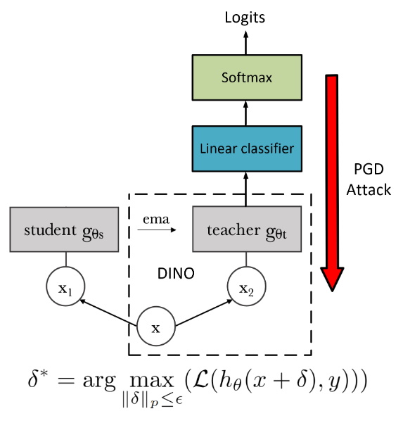

# V2V-Vulnerability-to-Vigilance: Fortifying DINO Models Against Adversarial Intrusions
### Authors : Ashay Ajbhani, Geeta Chandra Raju Bethala, Varuni Buereddy


<br>

Machine Learning classifiers, despite their sophistication, are
highly susceptible to adversarial attacks. We explore adver-
sarial attacks on machine learning models, emphasizing the
vulnerability of models to deliberate manipulations of in-
put data. Various adversarial attack algorithms, including the
Fast Gradient Sign Method (FGSM), Projected Gradient De-
scent (PGD), Transferable Adversarial Perturbations, DiffAttack are examined for their unique approaches
to deceiving models. The methodology covers experimental
setups, datasets, adversarial attacks (DiffAttack and PGD),
and defense strategies on DINO Representations. Evaluation results demon-
strate the impact of adversarial attacks on different models
and showcase a defense strategy, adversarial training the Dino Representations on the above attacks for improved ro-
bustness. Overall, the project contributes to the understanding of adversarial attacks and defense mechanisms in machine learning.

Dataset: Imagenet100

GPUs used for single-node and distributed-training : **NVIDIA RTX 8000, NVIDIA Tesla V100**.

# Adversarial Attack
```math
F_\theta(\text{Attack}(x ; G_\phi)) = F_\theta(x') \neq y
```
F is the target model, G is the surrogate model, x is the original data, x' is the adversarial image
## DiffAttack 


/// "indigo_bunting"


//// Transferability results
| Left columns  | Right columns |
| ------------- |:-------------:|
| left foo      | right foo     |
| left bar      | right bar     |
| left baz      | right baz     |


Adversarial Images Generated Using DiffAttack: [Link](https://drive.google.com/drive/folders/1_2S8KcZDavoir3M_b0lY7c95nvkO_wam?usp=drive_link )

## PGD Attack 
This function generates the PGD-L$\infty$ adversarial images 
```
def generate_attack(target_model, img, label):
    if args.pgd_attack == 'linf':
        adversary = LinfPGDAttack(target_model, loss_fn=None, eps=args.pgd_size, nb_iter=50, eps_iter=0.01, rand_init=True, clip_min=0.0, clip_max=1.0, targeted=False)
```
//////PGD attack Images

# Adversarial Training
## Dino Architecture 




## How to run?

Our proposed implementati
on (both single node and distributed) are in the folder `D3GAN`. Run the following command for **single GPU** training: 

To train on the entire dataset,

```
python main_dino.py --arch vit_small --patch_size 16 --epochs 100 --batch_size_per_gpu 32 --data_path /data/imagenet-100/ --output_dir ./save/ --saveckp_freq 5
```

You can save the load the checkpoint of the Dino from [this link](https://dl.fbaipublicfiles.com/dino/dino_deitsmall16_pretrain/dino_deitsmall16_pretrain_full_checkpoint.pth) or you can alternatively train from scratch

To evaluate the defense model on the classifier,

```
python ./dino/eval_linear.py --arch vit_small --patch_size 16 --epochs 100 --num_labels 100 --data_path /data/imagenet-100/ --output_dir ./save/ --linear_pretrained_weights ./checkpoint_Dino-reference_linear-010.pth.tar --evaluate
```


# Results and Observations

## Adversarial Attack


## Adversarial Defense


# Observations & Conclusions

Our experimental results show that the addition of another discriminator improves the quality of generated images **and its convergence is must faster**.

Our pipeline holds true across the majority of datasets that are widely used for generative modeling.

Even though training time increases because of an additional discriminator, the overall time to converge is much lesser than DCGAN.

We strongly believe that this pipeline could be generalized for multiple discriminators in the network. 

Stronger and faster convergence could be achieved with more sophisticated and deeper networks. 


